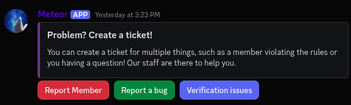

[](https://www.python.org/downloads/release/python-3130/)
[](https://discord.com/oauth2/authorize?client_id=1392608420556833030)
[](./LICENSE)
[](https://github.com/watchmypizza/TuxBot/issues)
[](https://discord.gg/eQ7FHcmHc9)

# What is this bot and how does it work?

The bot is supposed to be an all-in-one bot for moderation (Dyno), levels (Arcane), Counting (Counting) and Tickets (Ticket tool)

You can use chat commands (UNIX inspired) using the prefix **"$"**

Currently the bot has an amount of **51** commands. Though the number may vary every time the bot updates. Don't expect this number to be updated everytime there is a new command.

# Quick overview of features

- 🛠️ Moderation tools

- 📈 XP & level system with roles and rank cards

Example Rank Card: 

- 🔢 Counting game

- 🎟️ Ticket system with buttons

Example Ticket System:



- ⚙️ Per-server configuration (powered by Firestore)


- 🧠 AI Automod powered by Ollama


- 🪖 Raid Protection that locks channels

# Installation

- Python 3.13 is required

- Ollama and a model of your choice (Recommended for low end: Gemma3:4b)

- For low-end hardware: `ollama serve` `ollama pull gemma3:4b`

- `pip install -r requirements.txt`

- Create a `JSONS/` folder, place your Firebase service account JSON inside it, and create a `.env` file in the project root.

- Contents of the env are:

```
TOKEN=MTMxxxxxxxxxxxxxxxxxxxxxxxxxxxxxxxxxxx (discord bot token)
FIREBASE_JSON=Relative path to your firebase json (Example: JSONS/xxxxxxx-firebase-adminsdk-xxxxxxxxxx.json)
```

# Quickstart

```
git clone https://github.com/watchmypizza/TuxBot.git
cd TuxBot
pip install -r requirements.txt
ollama serve &
ollama pull gemma3:4b
touch .env
mkdir JSONS/
echo 'Thanks for downloading and using my project! If you enjoy working on my project, mind leaving a star:3?'
```

# Roadmap

[x] Base functionality, running bot

[x] Moderation commands

[x] Counting commands

[x] Per-Server configuration

[x] Level system

[x] Customisable level roles

[x] Configurable suggestions channel

[x] Auto-react to suggestions

[x] Recode settings logic and migrate to Firestore

[-] Dashboard

[x] Verification process

[x] Customisable prefix

[x] Modals and buttons

[x] Automod

[x] Tickets functionality (Replacing ticketbot)

[x] Smart automod (Using ollama)

[x] Raid-preventive commands

[ ] Binaries for windows & linux to just use it for your own bot

I'll add more to the roadmap, but for now we are done with basic commands. Always be prepared for more to come though!

> Have a suggestion? Join the [support server](https://discord.gg/eQ7FHcmHc9) and feel free to suggest your idea!
> Report a bug? Join the [support server](https://discord.gg/eQ7FHcmHc9) and feel free to open a ticket! You can also open a github issue!

<sub><sup>Suggestions are manually reviewed by the developer(s), who decide if they should be added.</sup></sub>

# Dashboard

Currently, a dashboard isn’t available due to Firebase billing. The bot and all its features will remain free and open-source.

# Command Overview

The bot has a total of 51 commands (including sub-commands). This number may update every once in a while, but don't expect it to be often.

<details>
<summary>Configuration Commands</summary>

- /configure levelroles →  Configure levelroles to add / remove them (you can add as many as you want)

- /configure logging →  Select a message logging channel

- /configure welcomer →  Select a channel like #welcome for welcome and goodbye messages

- /configure announcement →  Select a announcement channel for the $ wall command

- /configure modlogs →  Set a dedicated mod-logs channel to log moderation actions

- /configure botrole →  Set a role that is the bot role, members under this role will not be counted as members in the $ ls command

- /configure suggestions →  Configure a suggestions channel, so the bot can automatically react ✅ and ❌ to the suggestions.

- /configure verifiedrole →  Configure the role the bot should give a member after verifying successfully.

- /configure level_channel →  Configure the level channel to post level up announcements in.

- /configure resetprefix →  Reset the prefix to the default one.

- /configure prefix →  Set a custom prefix.

- /configure staff →  Set a custom staff role (needed for ticket system)

- /configure ticketlogs →  Set a custom ticket logs channel (needed for ticket system)

- (customprefix)newprefix →  Same as configuring a new prefix.

- /configure aiautomod →  Enable or disable the AI automod for your server.

- /configure staffcategory →  Configure the staff category for the anti-raid commands.

</details>

<details>
<summary>Counting Commands</summary>

- /counting configure →  Configure the counting aspect of the bot and tweak specific settings

- /counting reset →  Reset the current count

- /counting channel →  (mandatory) Select a dedicated counting channel (ex. #counting)

- /counting start →  Start counting in the counting channel

- /counting stop →  Stop / pause counting in the counting channel (This will not reset your count)
</details>

<details>
<summary>Level Commands</summary>

- /level show →  Show the level of yourself or from another user

- /level lock →  Lock a user's level and XP

- /level set →  Set the level/XP of a user

- /level exclude →  Exclude a channel from earning XP (ex. #counting, #spam)

- /level leaderboard →  Display the levelling leaderboard of your server
</details>

<details>
<summary>Miscellaneous</summary>

- $ ls →  Shows information about the server

- $ cat →  Open a file that is in the GitHub repo in read mode

- $ pwd →  Show the current path the bot is running on

- $ man <Command> →  Shows a description of the command

- $ wall <Message> →  Post a message to the announcement channel

- /latency →  Measure your latency to the bot

- /membercount →  Show the current membercount (this excludes the bot role aswell)

- /slash →  This is the first slash command added to the bot, it serves to get the active developer badge

- /suki →  A friend of mine suggested to add and name the command as is today, grabs a random cat image and sends a ephemeral

- /warnings →  Allows you to view your own warnings displayed as an ephemeral

- /verify →  Post the verification message.

</details>

<details>
<summary>Moderation</summary>

- $ rm -r(f) <User> --message <Reason> →  The option -rf bans a user, the option -r only kicks a user.

- $ clear →  Clear a specific amount of messages

- $ usermod -l <new username> <old username> →  Change the display name of a user

- /mute <User> <Duration> <Reason> →  Times a user out for a specified amount of time

- /warn <User> <Reason> →  Warns a user for the reason, also sends a DM to the user automatically

- /warnings <User> →  Shows the warnings for a user if they have any. (Looking at your own warnings does not require moderation privileges)

- /removewarn <User> <Number> →  Remove a warning from a user, you can view the number of warnings of a specific user by executing above command.

</details>

<details>
<summary>Raid Protection</summary>

- /antiraid lock →  Locks the current channel down

- /antiraid unlock →  Unlocks the current channel

- /antiraid serverlock →  Lock all of the server's channels except specialized categories

- /antiraid serverunlock →  Unlock all of the server's channel except specialized categories

</details>

<details>
<summary>Ticket Commands</summary>

- /ticketsystem setup →  Sets the ticket system up and sends a embed in the current channel with the buttons

- /ticketsystem category →  Set a category for tickets to be created in.

- /ticketsystem close →  Archives the ticket.

</details>